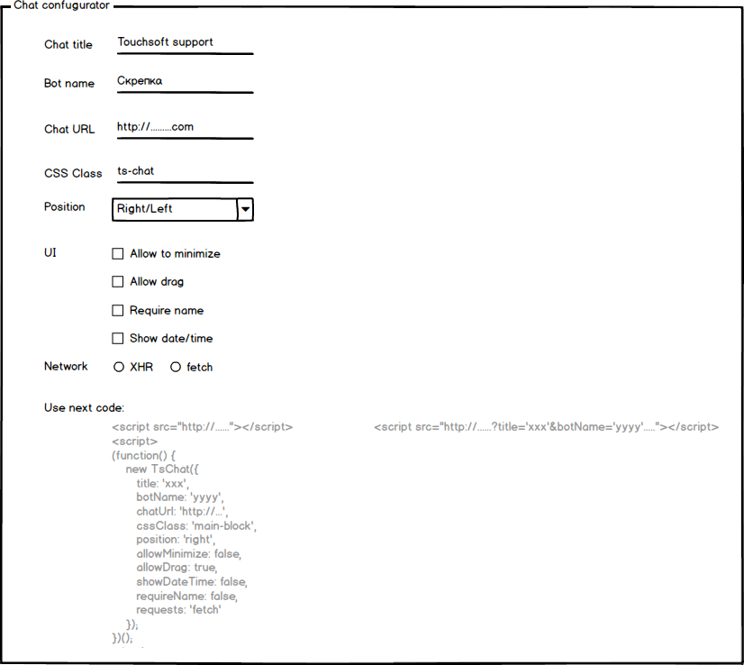

# Task 02 - Chat Configurator

Создать страницу для конфигурации скрипта чата.

Форма конфигурации позволяет настроить:

* Заголовок окна чата
* Имя бота
* URL к API
* CSS класс, который будет навешен на главный блок чата
* позицию чата (право/лево)
* разрешать ли сворачивание чата
* разрешать ли перетаскивание чата
* требовать ли от посетителя ввод имени
* показывать ли время в истории чата
* способ выполнения запросов (fetch/XHR)

При изменении любой из опций внизу формы конфигурации обновляется блок, который выдает пример кода, для встраивания чата в соотвествии с настройками.

## Функционал чата

Расширяется следующим образом:

* доступна опция требовать имя пользователя, до того, как появится возможность отправлять сообщения
* возможно перетаскивание окна чата по экрану с помощью мыши ( перетаскивание за заголовок )
* диалоги теперь должны сохраняться в базе [FireBase (посредством REST API)](<(https://firebase.google.com/docs/database/rest/start)>)

## Дополнение

Приложение ( как его части, так и оно целиком ), должны быть покрыты тестами [QUnit](https://qunitjs.com/).

В папке с выполненным заданием должен быть файл README со ссылками

* на пример работающего кода (например на [jsbin](http://jsbin.com/))
* на работающие тесты (можно загрузить туда же, на [jsbin](http://jsbin.com/) или использовать [glitch](https://glitch.com))

Эти же ссылки нужно прикрепить в описание пуллреквеста.

Для получения ссылкок на файлы с гитхаба можно использовать сервис https://rawgit.com/

## Дополнительная теория

* https://www.youtube.com/watch?v=8cV4ZvHXQL4
* https://www.youtube.com/watch?v=Ih6Q7ka2eSQ
* https://learn.javascript.ru/screencast/gulp
